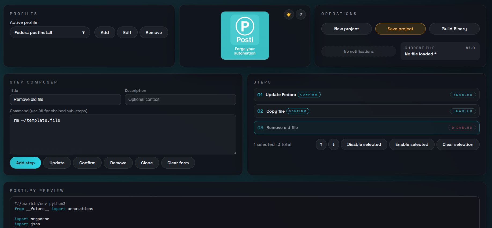
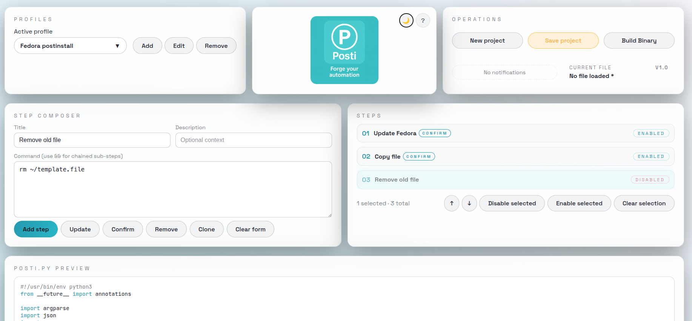

# Posti Forge

<p align="center">
  
</p>

**Posti Forge** is a post‑install automation designer. It lets you:

- ✅ Define **profiles** for different targets (e.g. Fedora, Ubuntu, kiosks, Windows etc).
- ✅ Compose ordered **steps** (commands with optional descriptions and confirmation gates).
- ✅ Preview the generated **`posti.py`** runner script with a CRT‑style console UI.
- ✅ Save your work as versioned Python scripts and build standalone binaries.

This repository contains a full web‑based designer and a backend builder wrapped in a single container.

---
## Demo / Screenshots

### Main UI
<p align="center">
  
  
</p>


## Features

- **Profile management**
  - Multiple profiles with custom labels.
  - Inline Add/Edit/Remove actions and safe delete confirmation.
- **Step composer**
  - Create sub-steps command chain by `&&`
  - Title, description, command, optional “Require confirmation” toggle.
  - Multi‑selection of steps with Ctrl/Shift and bulk enable/disable actions.
  - Clone, reorder via controls and enable/disable per step.
- **Posti script preview**
  - Live preview of the generated runner with Python syntax highlighting.
  - “Generate preview” and “Copy to clipboard” actions.
- **Project persistence**
  - “Save project” produces versioned files like `posti_v1.2.py`.
  - Scripts are saved on the server under `data/projects` and downloaded to your browser.
- **Binary builds**
  - One‑click “Build Binary” invokes PyInstaller in the backend.
  - Versioned binaries are stored under `data/generated_binary` and downloaded to the browser.
- **PWA support**
  - Installable as a Progressive Web App with a manifest, icons and a service worker for offline shell.

---

## Run with Docker (GHCR)

The easiest way to get started is to use compose file:

```yaml
services:
  posti:
    image: ghcr.io/pbuzdygan/posti:latest
    container_name: posti
    restart: unless-stopped
    ports:
      - "8012:8000"
    volumes:
      - ./data:/app/data
```

---

## Quick start (Docker Compose)

From the project root:

```bash
docker compose build
docker compose up -d
```

Then open the UI in your browser:

- http://localhost:8012/ (or the host/port you configured)

The default `docker-compose.yml` maps:

- `./data` on the host → `/app/data` inside the container.

This folder is used for persistence (see below).

---

## Data persistence layout

Under the bind‑mounted `data/` directory the backend expects:

- `data/projects` – versioned `posti_vX.Y.py` project files (from **Save project**).
- `data/generated_binary` – built binaries (from **Build Binary**).

You can create these subfolders yourself on the host, or let the backend attempt to create them. At startup, the backend logs a clear status for each area:

- if the directory is missing or not writable, it logs a warning but the app still runs;
- in that case, **downloads to the browser still work**, but nothing can be persisted to disk on the server.

Binary artifacts and saved scripts are marked executable (0755) where the filesystem/ACLs allow it.

---

## Using the designer

1. **Create a profile**
   - In the **Profiles** panel, click **Add**, name your profile and confirm.
   - The “Add” button pulses when no profiles exist to guide new users.
2. **Compose steps**
   - Use the **Step composer** to add steps with a title, description and command.
   - Toggle **Confirm** if a step should require confirmation at runtime.
3. **Preview posti.py**
   - In the **posti.py preview** panel, click **Generate preview**.
   - Review the script; use **Copy to clipboard** if you want to paste it elsewhere.
4. **Save project**
   - Click **Save project** in the **Operations** panel.
   - The app bumps the version (e.g. `1.0 → 1.1`), saves `posti_vX.Y.py` to `data/projects` (if possible) and downloads it to your browser.
5. **Build binary**
   - Click **Build Binary** to create a standalone executable from the current configuration.
   - The binary is stored in `data/generated_binary` and downloaded to your browser.

---

## PWA installation

Posti Forge is installable as a PWA:

- When conditions are met (served over HTTPS, supported browser), the app will show an **Install** banner.
- Alternatively, you can use your browser’s menu:
  - Desktop Chromium: “Install app…”
  - Android: “Add to Home screen”

Once installed, you get:

- Fullscreen, app‑like experience.
- Offline shell for the designer and `posti.py` preview (within the limits of cached resources).

---

## Development notes

For local development of the frontend only (outside the container):

1. Install Node.js (LTS) and pnpm/npm.
2. In `frontend/`:

   ```bash
   npm install
   npm run dev
   ```

   This starts Vite dev server (default http://localhost:5173/).

3. Ensure the backend (FastAPI + PyInstaller service) is reachable from the dev server, or set `VITE_BUILDER_URL` to point to the running API (e.g. `http://localhost:8000/api`).

For most users, running via `docker compose` as described above is sufficient.
