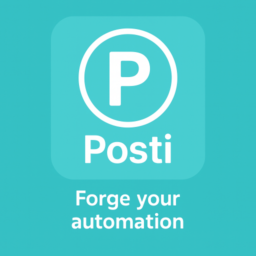
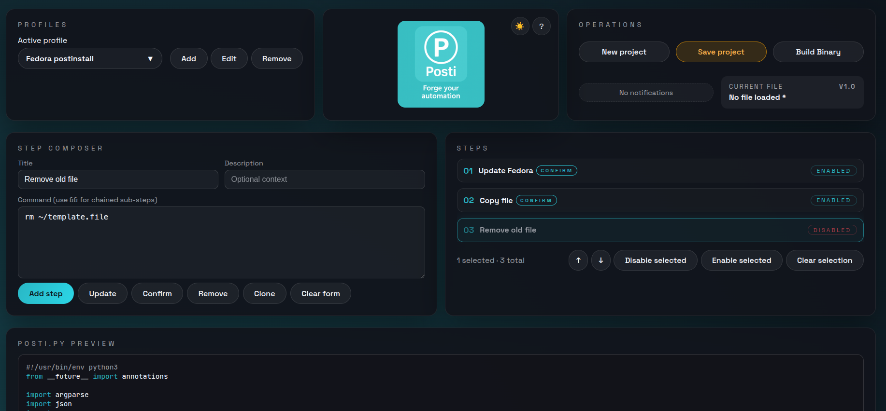
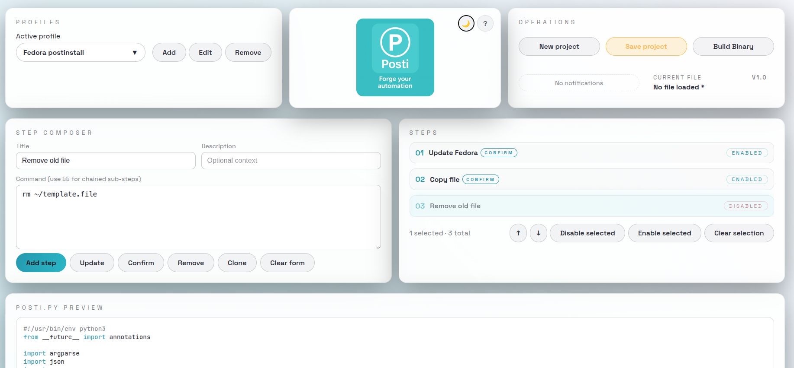

# Posti Forge

<p align="center">
  
</p>

**Posti Forge** is a post‑install automation designer. It lets you:

- ✅ Define **profiles** for different targets (e.g. Fedora, Ubuntu, kiosks, Windows etc).
- ✅ Compose ordered **steps** (commands with optional descriptions and confirmation gates).
- ✅ Preview the generated **`posti.py`** runner script with a CRT‑style console UI.
- ✅ Save each project in one canonical Python file with a ten-save undo history.

This repository contains a full web‑based designer and a backend builder wrapped in a single container.

---
## Demo / Screenshots

### Main UI
<p align="center">
  
  
</p>


## Features

- **Profile management**
  - Multiple profiles with custom labels.
  - Inline Add/Edit/Remove actions and safe delete confirmation.
- **Step composer**
  - Create sub-steps command chain by `&&`
  - Title, description, command, optional “Require confirmation” toggle.
  - Multi‑selection of steps with Ctrl/Shift and bulk enable/disable actions.
  - Clone, reorder via controls and enable/disable per step.
- **Posti script preview**
  - Live preview of the generated runner with Python syntax highlighting.
  - “Generate preview” and “Copy to clipboard” actions.
- **Project persistence**
  - The Profiles panel stays locked until a named project is created or loaded.
  - Confirming a new project name immediately creates `workstation_posti.py`.
  - “Save project” updates that file and retains the previous ten saved states.
  - “Load project” lists the scripts stored under `data/projects`; no local file picker is used.
- **Binary builds**
  - “Download Python” exports the current editor state as `project-name_posti.py`.
  - One‑click “Build Binary” invokes PyInstaller in the backend.
  - Versioned binaries are stored under `data/generated_binary` and downloaded to the browser.
- **PWA support**
  - Installable as a Progressive Web App with a manifest, icons and a service worker for offline shell.

---

## Run with Docker (GHCR)

Posti 2.1 runs as a non-root user and requires a numeric application PIN with at
least four digits. Start by preparing the configuration and data
directories:

```bash
cp .env.example .env
sed -i "s/^POSTI_UID=.*/POSTI_UID=$(id -u)/" .env
sed -i "s/^POSTI_GID=.*/POSTI_GID=$(id -g)/" .env
# Replace POSTI_APP_PIN in .env with your numeric PIN (at least four digits).
mkdir -p data/projects data/generated_binary
sudo chown -R "$(id -u):$(id -g)" data
```

The supplied production Compose configuration is equivalent to:

```yaml
services:
  posti:
    image: ghcr.io/pbuzdygan/posti:latest
    container_name: posti
    restart: unless-stopped
    user: "${POSTI_UID:-1000}:${POSTI_GID:-1000}"
    environment:
      HOME: /tmp
      POSTI_APP_PIN: "${POSTI_APP_PIN:?Set POSTI_APP_PIN in .env}"
    ports:
      - "127.0.0.1:${POSTI_PORT:-8012}:8000"
    volumes:
      - ./data:/app/data
    read_only: true
    tmpfs:
      - /tmp:size=512m,mode=1777
    cap_drop: [ALL]
    security_opt: [no-new-privileges:true]
    pids_limit: 256
    mem_limit: 2g
    cpus: 2.0
```

---

## Quick start (Docker Compose)

From the project root:

```bash
docker compose up -d
```

Then open the UI in your browser:

- http://localhost:8012/ (or the host/port you configured)

The default `docker-compose.yml` maps:

- `./data` on the host → `/app/data` inside the container.

This folder is used for persistence (see below).

The application starts on a full-screen PIN login. A successful login creates an
HTTP-only browser session; the designer and protected API remain unavailable before login.

The port is deliberately bound to localhost. If Posti must be reachable from
another machine, put it behind an authenticated HTTPS reverse proxy or a VPN;
do not publish the builder directly to an untrusted network.

---

## Data persistence layout

Under the bind‑mounted `data/` directory the backend expects:

- `data/projects` – the project library and source of truth used by **Save project**
  and **Load project**, with names such as `workstation_posti.py`. The hidden
  `.history` subdirectory retains at most ten previous saves per project.
- `data/generated_binary` – built binaries (from **Build Binary**).

Create these subfolders on the host before first start and make them writable by
the configured `POSTI_UID:POSTI_GID`. Startup now fails clearly if persistence is
not writable instead of silently running with broken server-side saves.

Binary artifacts and saved scripts are marked executable (0755) where the filesystem/ACLs allow it.

### Migrating files previously owned by root

Stop Posti and change the existing data tree once:

```bash
docker compose down
sudo chown -R "$(grep '^POSTI_UID=' .env | cut -d= -f2):$(grep '^POSTI_GID=' .env | cut -d= -f2)" data
docker compose up -d
```

For CIFS/NFS/NAS mounts, ownership may instead be controlled by share mount
options or ACLs. Align `uid`, `gid`, `file_mode`, and `dir_mode` with `.env`.

### Security and resource settings

- `POSTI_APP_PIN` — required numeric PIN containing at least four digits.
- `POSTI_SESSION_TTL_SECONDS` — login lifetime; default 12 hours.
- `POSTI_COOKIE_SECURE` — set to `true` when Posti is available over HTTPS.
- `POSTI_MAX_SCRIPT_BYTES` — maximum script size; default 1 MiB.
- `POSTI_BUILD_TIMEOUT_SECONDS` — PyInstaller timeout; default 180 seconds.
- `POSTI_BUILD_QUEUE_TIMEOUT_SECONDS` — second build wait time; default 2 seconds.
- `POSTI_BUILD_TEMP_MAX_AGE_SECONDS` — stale build cleanup age; default 24 hours.
- `POSTI_CORS_ORIGINS` — explicit comma-separated origins; disabled by default.

Only one binary build is admitted at a time. Compose also limits Posti to 2 CPUs,
2 GiB of RAM and 256 processes; these values can be adjusted for larger builds.
Because a short numeric PIN has limited entropy, expose Posti only through HTTPS
and a trusted LAN, VPN, or authenticated reverse proxy. Five failed attempts from
one client temporarily block further login attempts.

---

## Using the designer

1. **Create or load a project**
   - Enter a name above **Active profile** and click **Create project**. Posti immediately
     creates `project-name_posti.py`; unsafe filename characters are replaced automatically.
   - **New project** clears the current workspace and returns to this naming step.
   - Alternatively, click **Load project** and choose a saved script from `data/projects`.
   - Older `posti_vX.Y.py` scripts already present in that directory remain loadable.
   - Profile controls remain dimmed and unavailable until creation or loading succeeds.
2. **Create a profile**
   - In the **Profiles** panel, click **Add**, name your profile and confirm.
   - These controls become available after the project file has been created or loaded.
3. **Compose steps**
   - Use the **Step composer** to add steps with a title, description and command.
   - Toggle **Confirm** if a step should require confirmation at runtime.
4. **Preview posti.py**
   - In the **posti.py preview** panel, click **Generate preview**.
   - Review the script; use **Copy to clipboard** if you want to paste it elsewhere.
5. **Save project**
   - Click **Save project** in the **Operations** panel.
   - The app updates `project-name_posti.py` and retains up to ten earlier saves.
   - Use **Undo last save** to restore those states one at a time.
   - The server copy is the source of truth and is opened later through **Load project**.
6. **Download Python or build a binary**
   - Click **Download Python** to download the current editor state as
     `project-name_posti.py` without changing the saved project or its undo history.
   - Click **Build Binary** to create a standalone executable from the current configuration.
   - The `project-name_posti` binary is stored in `data/generated_binary` and downloaded to your browser.

---

## PWA installation

Posti Forge is installable as a PWA:

- When conditions are met (served over HTTPS, supported browser), the app will show an **Install** banner.
- Alternatively, you can use your browser’s menu:
  - Desktop Chromium: “Install app…”
  - Android: “Add to Home screen”

Once installed, you get:

- Fullscreen, app‑like experience.
- Offline shell for the designer and `posti.py` preview (within the limits of cached resources).

---

## Development notes

For local development of the frontend only (outside the container):

1. Install Node.js (LTS) and pnpm/npm.
2. In `frontend/`:

   ```bash
   npm install
   npm run dev
   ```

   This starts Vite dev server (default http://localhost:5173/).

3. Ensure the backend is reachable. For cross-origin development, set
   `VITE_BUILDER_URL` and add the frontend URL to `POSTI_CORS_ORIGINS`.
   Production should retain the default same-origin `/api` URL.

For most users, running via `docker compose` as described above is sufficient.

## Container release channels

Container images are built and published only when a GitHub Release is published.
A normal push to `main` or `dev` runs tests and audits but never builds or
publishes a container image.

Select the intended branch as the release target and use its matching tag format:

- a release targeting `main` uses `x.x.x` and publishes `latest` plus that version (for example,
  `latest` and `2.1.0`);
- a release targeting `dev` uses `devx.x.x` and publishes `dev_latest` plus that version (for example,
  `dev_latest` and `dev2.1.0`).

The publishing workflow rejects other release targets and version formats. It
also verifies that the released commit belongs to the selected branch before
uploading either image tag.
